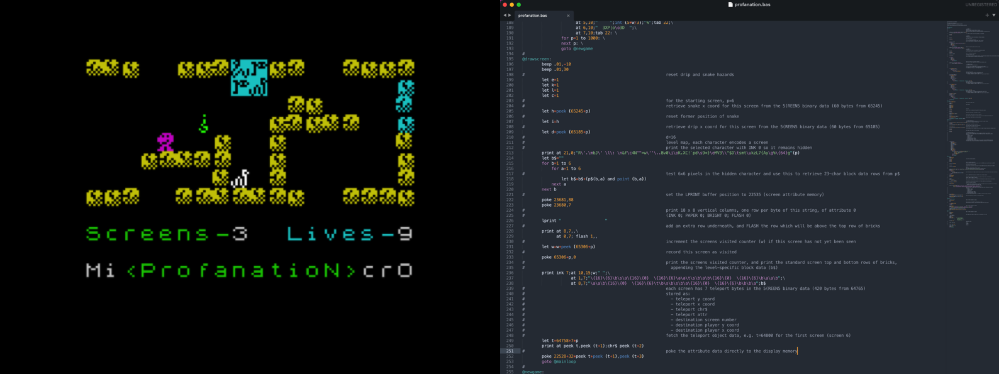

# MicroProfanation - a commented source

An extremely well crafted BASIC programming competition-winner for the ZX Spectrum, by [IvanBasic](https://spectrumcomputing.co.uk/list?label_id=16585).

[](https://spectrumcomputing.co.uk/forums/viewtopic.php?t=8372)

This game is a very large platform game which runs at a decent playable speed - neither of which are typically possible in Sinclair BASIC. It's a micro version of the 1985 Dynamix pyramid exploring game [Abu Simbel Profanation](https://spectrumcomputing.co.uk/entry/48/ZX-Spectrum/Abu_Simbel_Profanation). IvanBasic won the BASIC category of Argentinian computer museum Espacio Tec's [Retrogame Dev competition 2022](https://twitter.com/tbrazil_speccy?ref_src=twsrc%5Etfw%7Ctwcamp%5Etweetembed%7Ctwterm%5E1589174459692650498%7Ctwgr%5E%7Ctwcon%5Es2_&ref_url=).

Each of his previous games sidesteps the conventional limitations of the BASIC language, with outstanding results:
- [Rompetechos](https://spectrumcomputing.co.uk/entry/30322/ZX-Spectrum/Rompetechos), a large adventure game with great cartoon graphics and responsive controls
- [Brain 8](https://spectrumcomputing.co.uk/entry/34781/ZX-Spectrum/Brain_8) - scrolls and animates a full screen of ROM-generated graphics at speed
- [Aznar The Sport Star](https://spectrumcomputing.co.uk/entry/35104/ZX-Spectrum/Aznar_The_Sport_Star), sports game with responsive controls
- [Pedro Pomez](https://spectrumcomputing.co.uk/entry/35343/ZX-Spectrum/Pedro_Pomez - a platform game with a [vast colourful map](https://maps.speccy.cz/map.php?id=PedroPomez&sort=4&part=16&ath=0)
- [Micro Gauntlet](https://bunsen.itch.io/micro-gauntlet-by-ivanbasic) - ruthless programming minimalism yet perfectly captures the spirit of the original
- [STOP THE micro EXPRESS](https://bunsen.itch.io/stop-the-micro-express-by-ivanbasic) - similar but even more technically ambitious

These games are eye-opening to what can be achieved via the humble ZX Spectrum's native BASIC interpreter, and picking them apart to understand them is always interesting. This particular listing uses an ingenious method of encoding its levels using the bitmap data in regular characters to encode the selection of level building primitives. The primitives are stored as strings containing inline positioning and formatting escape sequences.

Unfortunately optimised Sinclair BASIC listings tend to use techniques which improve performance at the significant expense of comprehension - single letter variable names, huge long lines, a confusing structure to keep critical loops at the top, no comments, etc.

However it is possible to use a modern tool such as [zmakebas](https://github.com/ohnosec/zmakebas) to tease the listing apart, to indent and line-wrap, to comment it in a way that won't slow down execution, and to use more intuitive labels instead of line numbers.

I have updated my own [Sublime syntax highlighter for ZX BASIC](https://github.com/patters-syno/zx-basic-syntax) to also format zmakebas listings, which makes them much more readable as seen above.

## Source files

- **[microprofanation.bas](https://github.com/patters-syno/profanation/blob/main/profanation.bas)** will build to functionally the same game as the [original release](https://spectrumcomputing.co.uk/zxdb/add/public/uploads/38861_48_en.tap), with some minor tweaks that could make it very slightly slower. There is a touch more calculation for the relative GO TOs, though they aren't really performance-critical, and breaking up the big lines was necessary as *zmakebas* does not permit comments among line-wrapped content. I can't really tell the difference when play testing.

- **data.bin.tap** is the binary data for the screen building blocks, each screen's metadata, and the user-defined graphics in TAP format ready to be concatenated to the built BASIC binary. If this was strictly a 1980s magazine type-in this data ought to be part of the listing, but it would just slow things down a lot doing an initial READ from DATA statements, so I didn't convert it.

## Building

These files can be assembled back into the original ```.tap``` file using [zmakebas](https://github.com/ohnosec/zmakebas).

  ```bash
  zmakebas -n MicroProfa -o program.tap -l -i 10 -a @initialise profanation.bas
  
  # macOS
  cat program.tap data.bin.tap > MicroProfanation.tap
  
  # Windows
  copy /b program.tap+data.bin.tap MicroProfanation.tap
  ```
  
